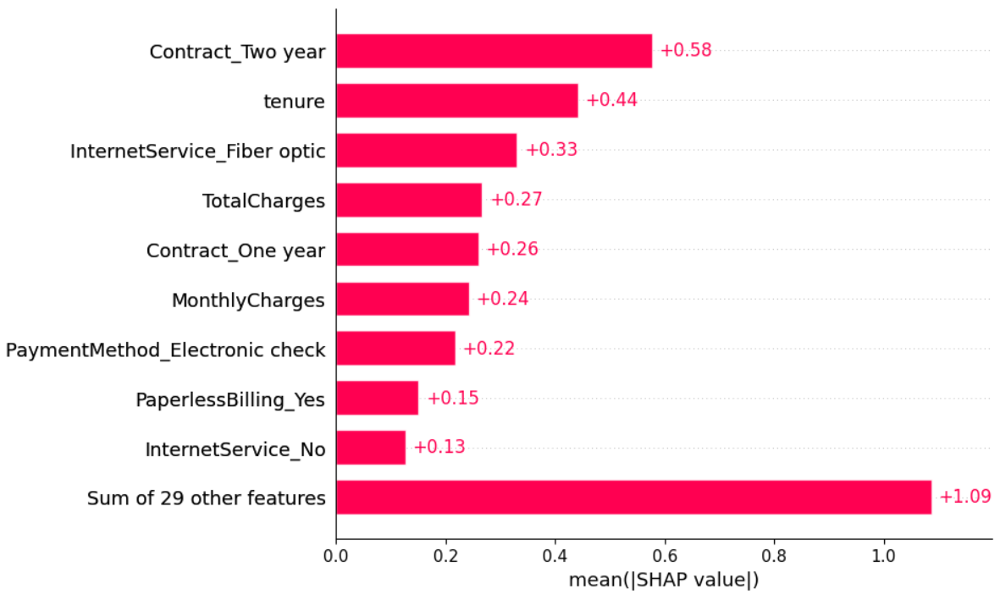

📉 Customer Churn Prediction & Retention Strategy System

A production-style end-to-end Machine Learning system that predicts customer churn and translates model insights into actionable business strategies.

🎯 Problem Statement

Customer churn significantly impacts telecom profitability.
Acquiring new customers is more expensive than retaining existing ones.

The objective of this project:

Predict churn probability using ML

Identify high-risk customers

Translate data patterns into retention strategies

Deploy the model as a cloud-based prediction service

📊 Exploratory Data Analysis (EDA)

During EDA, several strong churn patterns emerged:

🔍 Key Observations
📅 Tenure Effect

Most churn occurs within the first year

Churn rate drops significantly after 12 months

Early-stage customers are highly vulnerable

💰 Pricing Sensitivity

Higher monthly charges correlate with higher churn

Price sensitivity clearly exists

Customers in high price bins churn more

👵 Senior Citizens

Senior citizens churn at a higher rate

Possible reasons: pricing, complexity, or support gaps

🛠 Service Add-ons

Customers without the following churn more:

Online Security

Tech Support

These services act as retention anchors.

📄 Contract Type

Month-to-month customers show the highest churn.

🔴 High-Risk Customer Profile

Based on EDA + Model patterns:

High churn risk customers typically have:

📅 Tenure < 1 year

📄 Month-to-month contract

🔐 No Online Security

💳 Electronic check payment

💰 Higher monthly charges

🛠 No Tech Support

This profile is validated by both statistical patterns and model behavior.

🧠 Model Development
🔧 Preprocessing

Removed customerID

Converted TotalCharges to numeric

Median imputation for missing values

One-hot encoding using pandas.get_dummies

Column alignment during inference

Handled class imbalance using scale_pos_weight

🤖 Models Tested

Logistic Regression (baseline)

Random Forest

Gradient Boosting

XGBoost (final model)

🏆 Final Model: XGBoost

Why XGBoost?

Handles non-linearity well

Performs better with tabular data

Robust against class imbalance

High recall for churn detection

📈 Risk Categorization

High Risk: Probability ≥ 0.60

Medium Risk: 0.45 – 0.60

Low Risk: < 0.45

User → Streamlit UI → FastAPI Backend → XGBoost Model → Prediction → UI
threshold :0.45
Class 0 (Non-Churn):
Precision: 0.91
Recall:    0.71
F1:        0.80

Class 1 (Churn):
Precision: 0.50
Recall:    0.81
F1:        0.62

Accuracy:  0.74

custmor_churn/
│
├── backend/
│   ├── main.py
│   ├── Dockerfile
│   ├── requirements.txt
│   └── model/
│
├── frontend/
│   ├── app.py
│   └── requirements.txt
│
├── notebooks/
│   └── churn.ipynb
│
└── README.md

Tech Stack

Python

Pandas

Scikit-learn

XGBoost

FastAPI

Streamlit

Docker

Render

Streamlit Cloud

SHAP 

🌐 Live Deployment

Frontend:
https://custmorchurn-839e7xpxnbxvvimp6cxwnc.streamlit.app/

Backend API:
https://churnx-cipb.onrender.com/docs
